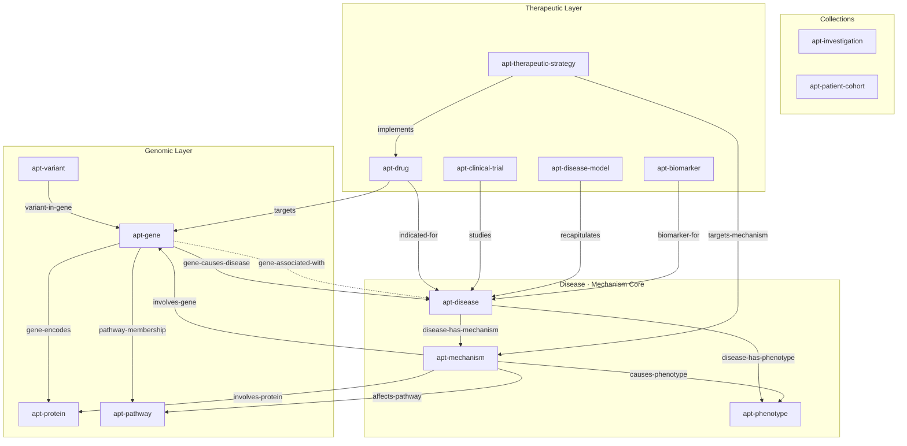
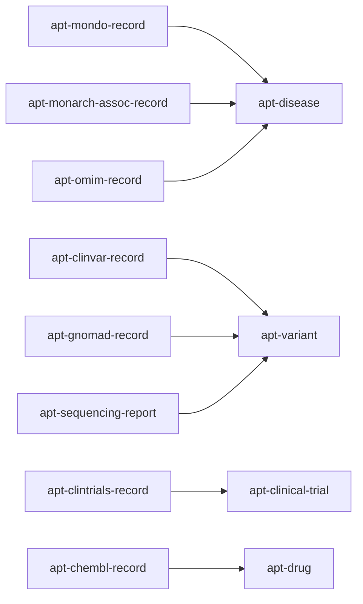
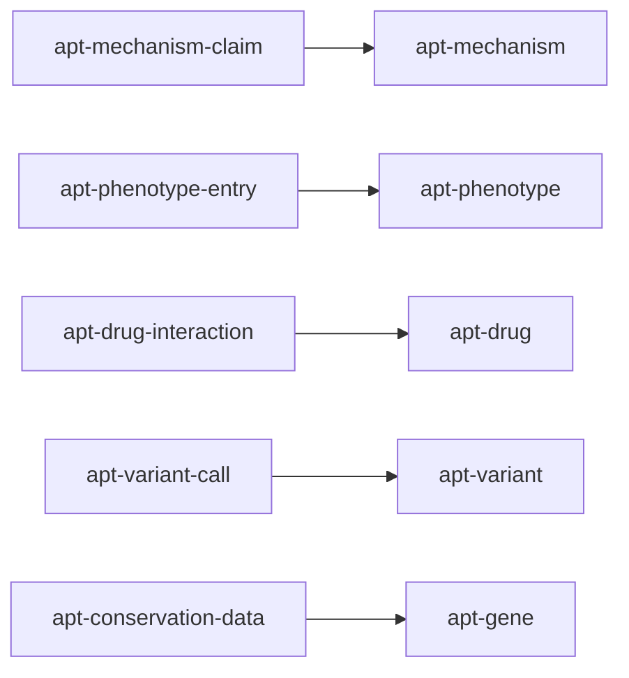
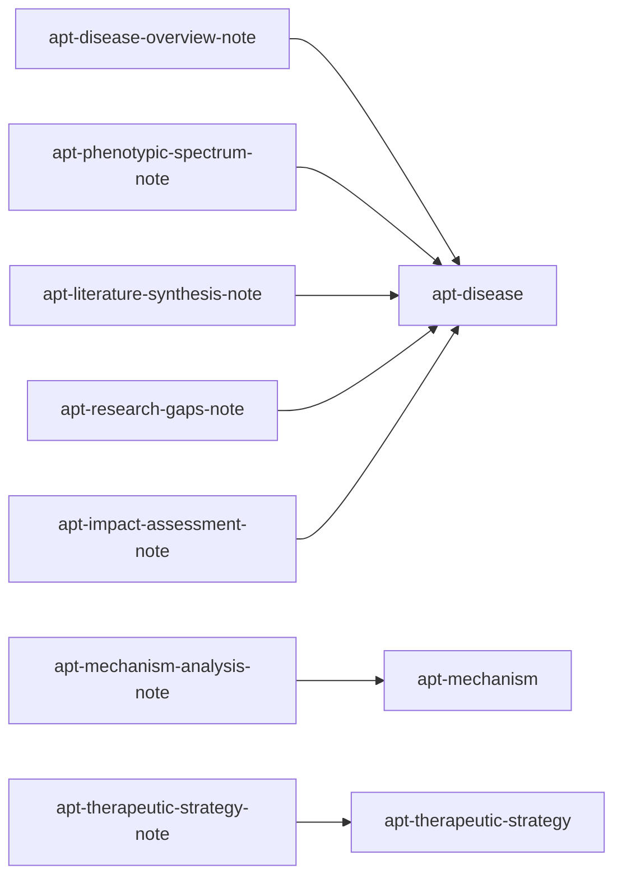

# Algorithm for Precision Therapeutics (APT)

A knowledge graph skill for systematic rare disease mechanism-of-harm investigation and
therapeutic landscape analysis. Starting from a known MONDO disease ID, it builds a
mechanism-centered knowledge graph connecting causal genes through biological pathways
to clinical phenotypes, then maps rational therapeutic strategies onto that mechanism map.

Implements **Matt Might's Algorithm for Precision Medicine (APM) Phase 2 — Therapeutic
Phase** as a structured, reproducible knowledge curation workflow.

---

## When to Use This

Use this skill when:
- A diagnosis is **already known** (you have a MONDO ID or disease name)
- The goal is to understand **how the disease causes harm** at the molecular level
- You want to build a **therapeutic landscape** — what treatments exist or are rational
- You need a structured **rare disease knowledge graph** for a specific condition

**Not for:** differential diagnosis, variant pathogenicity classification, or finding a
diagnosis from symptoms.

---

## The Central Innovation: `apt-mechanism` as a First-Class Entity

Most disease databases treat "mechanism of harm" as a label on a gene–disease relation.
APT promotes it to a **first-class entity** — `apt-mechanism` — with rich attributes and
its own relation chains:

```
Gene → [mechanism-involves-gene] → Mechanism → [mechanism-causes-phenotype] → Phenotype
                                        ↑
                              [strategy-targets-mechanism]
                                        |
                             TherapeuticStrategy → [strategy-implements] → Drug
```

This makes the knowledge graph traversable from genomic cause through biological mechanism
to clinical presentation and back up to therapeutic intervention — all as explicit,
queryable graph paths.

---

## Schema Diagram



**Solid arrows** = causal / mechanistic relations. **Dashed arrow** = statistical association
(non-causal). The `apt-mechanism` node is the hub connecting the genomic layer (left) to
the therapeutic layer (top) and phenotypic outcomes (right).

---

## Five-Phase Workflow

### Phase 1 — Foraging: Find and Initialize the Disease

Search for a MONDO ID and create the investigation root:

```bash
SCRIPT=".claude/skills/alg-precision-therapeutics/alg_precision_therapeutics.py"

uv run python $SCRIPT search-disease --query "NGLY1 deficiency"
# => {"diseases": [{"mondo_id": "MONDO:0800044", "name": "NGLY1 deficiency", ...}]}

uv run python $SCRIPT init-investigation MONDO:0800044
# Creates: apt-disease + apt-investigation + apt-mondo-record artifact
```

### Phase 2 — Ingestion: Pull External Data

Automated retrieval from Monarch Initiative, ClinicalTrials.gov, and ChEMBL:

```bash
# Full pipeline in one command:
uv run python $SCRIPT ingest-disease --mondo-id MONDO:0800044

# Or step by step:
uv run python $SCRIPT ingest-phenotypes --disease apt-disease-xxxx  # Monarch HPO
uv run python $SCRIPT ingest-genes      --disease apt-disease-xxxx  # Monarch gene associations
uv run python $SCRIPT ingest-hierarchy  --disease apt-disease-xxxx  # MONDO subclass tree
uv run python $SCRIPT ingest-clintrials --disease apt-disease-xxxx  # ClinicalTrials.gov
uv run python $SCRIPT ingest-drugs      --disease apt-disease-xxxx  # ChEMBL drug targets
```

All retrieved data is stored as **artifacts** (raw API responses) in TypeDB, ready for
Claude to read during sensemaking.

### Phase 3 — Sensemaking: Claude Reads Artifacts

Claude reads the raw artifacts and synthesizes:
- What mechanism(s) of harm are implied by the gene associations?
- Which genes are causally implicated vs. statistically associated?
- What is the severity and breadth of the phenotypic burden?
- What therapeutic modalities are plausible given the mechanism type?

```bash
uv run python $SCRIPT list-artifacts --disease apt-disease-xxxx
uv run python $SCRIPT show-artifact --id apt-artifact-xxxx
```

### Phase 4 — Build the Mechanism Knowledge Graph

Claude constructs the mechanism graph based on sensemaking, using the APM mechanism
taxonomy:

| Type | Description |
|------|-------------|
| `GoF` | Gain of function — protein does too much |
| `LoF-partial` | Partial loss of function — reduced activity |
| `LoF-total` | Complete loss of function — absent activity |
| `dominant-negative` | Mutant protein inhibits wild-type |
| `haploinsufficiency` | One copy insufficient for normal function |
| `toxic-aggregation` | Toxic protein accumulation |
| `pathway-dysregulation` | Indirect pathway dysregulation |

```bash
# Add mechanism of harm
uv run python $SCRIPT add-mechanism \
  --disease apt-disease-xxxx \
  --type LoF-total \
  --level molecular \
  --description "NGLY1 loss of function prevents deglycosylation of misfolded proteins"

# Link to causal gene, affected pathway, downstream phenotypes
uv run python $SCRIPT link-mechanism-gene      --mechanism apt-mechanism-xxxx --gene apt-gene-xxxx
uv run python $SCRIPT link-mechanism-phenotype --mechanism apt-mechanism-xxxx --phenotype apt-phenotype-xxxx

# Add a therapeutic strategy targeting this mechanism
uv run python $SCRIPT add-strategy \
  --mechanism apt-mechanism-xxxx \
  --modality enzyme-replacement \
  --rationale "Restore NGLY1 enzymatic activity via ERT or gene therapy"

# Link a drug to the strategy
uv run python $SCRIPT link-drug-mechanism --drug apt-drug-xxxx --mechanism apt-mechanism-xxxx
```

### Phase 5 — Analysis Views

Structured views of the completed knowledge graph:

```bash
uv run python $SCRIPT show-disease          --mondo-id MONDO:0800044  # Full overview
uv run python $SCRIPT show-mechanisms       --mondo-id MONDO:0800044  # Mechanism chains
uv run python $SCRIPT show-therapeutic-map  --mondo-id MONDO:0800044  # Strategies per mechanism
uv run python $SCRIPT show-phenome          --mondo-id MONDO:0800044  # Phenotypic spectrum
uv run python $SCRIPT show-genes            --mondo-id MONDO:0800044  # Gene evidence table
uv run python $SCRIPT show-trials           --mondo-id MONDO:0800044  # Clinical trials
uv run python $SCRIPT build-corpus          --mondo-id MONDO:0800044  # Literature search seeds
```

---

## Entity Types

### Domain Things (the scientific objects)

| Entity | Key Identifiers | Description |
|--------|----------------|-------------|
| `apt-disease` | MONDO, OMIM, ORPHA, DOID | The disease under investigation |
| `apt-gene` | HGNC, Ensembl, Entrez | Causal or associated gene |
| `apt-protein` | UniProt, domain annotations | Protein product of a gene |
| `apt-mechanism` | type, level, addressability | **First-class mechanism of harm entity** |
| `apt-pathway` | Reactome, GO | Biological pathway implicated in the mechanism |
| `apt-phenotype` | HPO | Clinical feature observable in patients |
| `apt-variant` | HGVS c/p/g, ACMG class | Genomic variant (for cohort tracking) |
| `apt-drug` | DrugBank, ChEMBL, modality | Therapeutic compound |
| `apt-therapeutic-strategy` | approach, modality | Rational therapeutic approach |
| `apt-clinical-trial` | NCT ID, phase, status | Clinical trial studying the disease |
| `apt-disease-model` | species, model type | Experimental model system |
| `apt-biomarker` | type | Measurable disease-state indicator |

### Collections (organisational roots)

| Entity | Description |
|--------|-------------|
| `apt-investigation` | MONDO-rooted investigation — the top-level container |
| `apt-patient-cohort` | Optional set of patients sharing phenotype/genotype |

---

## Artifacts, Fragments, and Notes

The APT schema follows the Alhazen content hierarchy for captured knowledge.
Each domain entity is paired with **artifacts** (raw API responses ingested automatically),
**fragments** (structured claims extracted from those artifacts), and **notes** (Claude's
analysis and synthesis). The diagram below shows how each content type maps to the domain
entities it describes.

**Artifacts** → domain entities they capture:



**Fragments** → domain entities they assert claims about:



**Notes** → domain entities they analyse:



**Artifacts** (raw API captures):

| Artifact | Source |
|----------|--------|
| `apt-mondo-record` | MONDO ontology lookup |
| `apt-monarch-assoc-record` | Monarch Initiative phenotype/gene associations |
| `apt-omim-record` | OMIM disease entry |
| `apt-clinvar-record` | ClinVar variant classifications |
| `apt-gnomad-record` | gnomAD population frequency data |
| `apt-clintrials-record` | ClinicalTrials.gov study records |
| `apt-chembl-record` | ChEMBL drug–target associations |
| `apt-sequencing-report` | Patient sequencing report |

**Fragments** (extracted claims from artifacts):

| Fragment | Content |
|----------|---------|
| `apt-mechanism-claim` | Extracted mechanism assertion with confidence |
| `apt-phenotype-entry` | HPO phenotype with frequency and evidence code |
| `apt-drug-interaction` | Drug mechanism-of-action extracted from ChEMBL |
| `apt-variant-call` | HGVS variant call with ACMG classification |

**Notes** (Claude's analysis):

| Note | Content |
|------|---------|
| `apt-disease-overview-note` | High-level disease summary |
| `apt-mechanism-analysis-note` | Detailed mechanism-of-harm reasoning |
| `apt-therapeutic-strategy-note` | Therapeutic approach rationale |
| `apt-phenotypic-spectrum-note` | Phenotypic burden analysis |
| `apt-literature-synthesis-note` | Synthesis across literature |
| `apt-research-gaps-note` | Unresolved questions and evidence gaps |
| `apt-impact-assessment-note` | Patient impact and clinical significance |

---

## External Data Sources

| Source | Data | API |
|--------|------|-----|
| [Monarch Initiative v3](https://monarchinitiative.org) | Disease→phenotype, disease→gene associations | `https://api-v3.monarchinitiative.org/v3/api` |
| [ClinicalTrials.gov](https://clinicaltrials.gov) | Active and completed trials | `https://clinicaltrials.gov/api/v2/studies` |
| [ChEMBL](https://www.ebi.ac.uk/chembl/) | Drug–target associations by gene symbol | `https://www.ebi.ac.uk/chembl/api/data` |
| [MONDO](https://mondo.monarchinitiative.org) | Disease ontology hierarchy and xrefs | Via Monarch API |

---

## Prerequisites

- TypeDB 3.x running: `make db-start`
- APT schema loaded: `make db-init`
- Python deps: `uv sync --all-extras`

---

## Knowledge Graph Queries

The APT knowledge graph supports direct TypeQL queries for deep mechanism analysis beyond
what the CLI views expose. The queries below cover the most useful analytical questions, using
NGLY1 deficiency (`MONDO:0800044`) as the running example — substitute the MONDO ID for any
disease in your graph.

### Running Queries

**Via Python TypeDB driver:**
```python
from typedb.driver import TypeDB, Credentials, DriverOptions, TransactionType

driver = TypeDB.driver(
    "localhost:1729",
    Credentials("admin", "password"),
    DriverOptions(is_tls_enabled=False),
)

with driver.transaction("alhazen_notebook", TransactionType.READ) as tx:
    results = list(tx.query("""
        match
          $d isa apt-disease, has apt-mondo-id "MONDO:0800044";
          ...
        fetch { ... };
    """).resolve())
    for row in results:
        print(row)   # plain Python dicts — no .get("value") unwrapping needed
```

**Via TypeDB Studio** — connect to `localhost:1729`, open `alhazen_notebook`, paste queries
into the editor.

**Inspect CLI output before writing queries** — always dump raw output first to confirm key
names before writing key-access post-processors:
```bash
uv run python .claude/skills/alg-precision-therapeutics/alg_precision_therapeutics.py \
    show-mechanisms --mondo-id MONDO:0800044 2>/dev/null \
    | python3 -c "import json,sys; print(json.dumps(json.load(sys.stdin),indent=2))"
```

---

### 1. Mechanism Profile Queries

**All mechanisms for a disease — with evidence quality:**

Useful as the first query on a new investigation to see what mechanism types and evidence
levels have been curated.

```typeql
match
  $d isa apt-disease, has apt-mondo-id "MONDO:0800044",
      has name $dname;
  $m isa apt-mechanism,
      has name $mname,
      has apt-mechanism-type $mtype,
      has apt-mechanism-level $mlevel,
      has apt-mechanism-evidence-strength $strength,
      has apt-therapeutic-addressability $druggable;
  ($d, $m) isa apt-disease-has-mechanism;
fetch {
  "disease": $dname,
  "mechanism": $mname,
  "type": $mtype,
  "level": $mlevel,
  "evidence_strength": $strength,
  "therapeutically_addressable": $druggable
};
```

**Full gene-to-phenotype causal chain:**

The core APT reasoning chain — traces the path from genomic cause through mechanism to
clinical manifestation. Each row is one `gene → mechanism → phenotype` triple.

```typeql
match
  $d isa apt-disease, has apt-mondo-id "MONDO:0800044";
  $m isa apt-mechanism,
      has name $mname,
      has apt-mechanism-type $mtype;
  $g isa apt-gene, has apt-gene-symbol $gsym;
  $p isa apt-phenotype,
      has apt-hpo-id $hpo_id,
      has apt-hpo-label $plabel;
  ($d, $m) isa apt-disease-has-mechanism;
  ($m, $g) isa apt-mechanism-involves-gene;
  ($m, $p) isa apt-mechanism-causes-phenotype;
fetch {
  "mechanism": $mname,
  "mechanism_type": $mtype,
  "causal_gene": $gsym,
  "downstream_phenotype": $plabel,
  "hpo_id": $hpo_id
};
```

**GoF / overactivity mechanisms — potential inhibitor targets:**

Mechanisms with `apt-functional-impact = "overactivity"` are candidates for small-molecule
inhibitors, antisense oligonucleotides, or blocking antibodies.

```typeql
match
  $d isa apt-disease, has apt-mondo-id "MONDO:0800044";
  $m isa apt-mechanism,
      has name $mname,
      has apt-mechanism-type $mtype,
      has apt-functional-impact "overactivity";
  $g isa apt-gene, has apt-gene-symbol $gsym;
  ($d, $m) isa apt-disease-has-mechanism;
  ($m, $g) isa apt-mechanism-involves-gene;
fetch {
  "mechanism": $mname,
  "mechanism_type": $mtype,
  "causal_gene": $gsym
};
```

**LoF / underactivity mechanisms — augmentation or replacement targets:**

Complement of the above — mechanisms requiring enzyme replacement, gene therapy, or
substrate reduction strategies.

```typeql
match
  $d isa apt-disease, has apt-mondo-id "MONDO:0800044";
  $m isa apt-mechanism,
      has name $mname,
      has apt-mechanism-type $mtype,
      has apt-functional-impact $impact;
  $g isa apt-gene, has apt-gene-symbol $gsym;
  ($d, $m) isa apt-disease-has-mechanism;
  ($m, $g) isa apt-mechanism-involves-gene;
  { $impact = "underactivity"; } or { $impact = "absence"; };
fetch {
  "mechanism": $mname,
  "mechanism_type": $mtype,
  "functional_impact": $impact,
  "causal_gene": $gsym
};
```

---

### 2. Phenotypic Analysis Queries

**Phenotypes by frequency tier — burden map:**

Reveals which clinical features are obligate vs. occasional and should anchor outcome
measures for any trial.

```typeql
match
  $d isa apt-disease, has apt-mondo-id "MONDO:0800044";
  $p isa apt-phenotype,
      has apt-hpo-id $hpo_id,
      has apt-hpo-label $plabel;
  ($d, $p) isa apt-disease-has-phenotype, has apt-frequency-qualifier $freq;
fetch {
  "hpo_id": $hpo_id,
  "phenotype": $plabel,
  "frequency": $freq
};
```

**Phenotypes with no mechanistic explanation:**

Clinical features present in the disease that are not yet linked to any curated mechanism.
These represent either incomplete curation or secondary / emergent biology.

```typeql
match
  $d isa apt-disease, has apt-mondo-id "MONDO:0800044";
  $p isa apt-phenotype,
      has apt-hpo-id $hpo_id,
      has apt-hpo-label $plabel;
  ($d, $p) isa apt-disease-has-phenotype;
  not { ($m, $p) isa apt-mechanism-causes-phenotype; };
fetch {
  "unexplained_phenotype": $plabel,
  "hpo_id": $hpo_id
};
```

**Phenotypes caused by a specific mechanism — projected clinical impact of a therapy:**

Given a mechanism, what symptoms should improve if that mechanism is corrected? Useful for
designing outcome measures.

```typeql
match
  $m isa apt-mechanism, has name "NGLY1 LoF — deglycosylation failure";
  $p isa apt-phenotype,
      has apt-hpo-id $hpo_id,
      has apt-hpo-label $plabel;
  ($m, $p) isa apt-mechanism-causes-phenotype;
fetch {
  "phenotype": $plabel,
  "hpo_id": $hpo_id
};
```

---

### 3. Therapeutic Landscape Queries

**Therapeutic strategies and drugs per mechanism:**

The full therapeutic map — which strategies and drug candidates address which mechanisms.

```typeql
match
  $d isa apt-disease, has apt-mondo-id "MONDO:0800044";
  $m isa apt-mechanism,
      has name $mname,
      has apt-mechanism-type $mtype;
  $s isa apt-therapeutic-strategy,
      has name $sname,
      has apt-therapeutic-approach $approach,
      has apt-therapeutic-modality $modality;
  $drug isa apt-drug,
      has name $dname,
      has apt-drug-class $dclass;
  ($d, $m) isa apt-disease-has-mechanism;
  ($s, $m) isa apt-strategy-targets-mechanism;
  ($s, $drug) isa apt-strategy-implements;
fetch {
  "mechanism": $mname,
  "mechanism_type": $mtype,
  "strategy": $sname,
  "approach": $approach,
  "modality": $modality,
  "drug": $dname,
  "drug_class": $dclass
};
```

**Drugs targeting causal genes (ChEMBL data):**

Existing compounds that modulate the causal gene — the starting point for a repurposing
scan. `apt-development-stage` from the entity reflects the most advanced approved indication.

```typeql
match
  $d isa apt-disease, has apt-mondo-id "MONDO:0800044";
  $g isa apt-gene, has apt-gene-symbol $gsym;
  $drug isa apt-drug,
      has name $dname,
      has apt-therapeutic-modality $modality,
      has apt-development-stage $stage;
  ($g, $d) isa apt-gene-causes-disease;
  ($drug, $g) isa apt-drug-targets, has apt-mechanism-of-action $moa;
fetch {
  "causal_gene": $gsym,
  "drug": $dname,
  "modality": $modality,
  "development_stage": $stage,
  "mechanism_of_action": $moa
};
```

**Clinical trials by phase and status:**

Snapshot of the clinical development landscape — how far along is the field, what
interventional modalities are being tested.

```typeql
match
  $d isa apt-disease, has apt-mondo-id "MONDO:0800044";
  $t isa apt-clinical-trial,
      has name $tname,
      has apt-nct-id $nct_id,
      has apt-trial-phase $phase,
      has apt-trial-status $status;
  ($t, $d) isa apt-trial-studies;
fetch {
  "trial_name": $tname,
  "nct_id": $nct_id,
  "phase": $phase,
  "status": $status
};
```

**Strategies targeting the same mechanism type across all diseases:**

Finds therapeutic strategies curated for any disease that share the same mechanism type
as the target disease — surfaces potentially transferable approaches.

```typeql
match
  $target isa apt-disease, has apt-mondo-id "MONDO:0800044";
  $target_mech isa apt-mechanism, has apt-mechanism-type $mtype;
  ($target, $target_mech) isa apt-disease-has-mechanism;
  $other isa apt-disease, has name $other_name;
  $other_mech isa apt-mechanism, has apt-mechanism-type $mtype;
  $s isa apt-therapeutic-strategy,
      has name $sname,
      has apt-therapeutic-approach $approach,
      has apt-therapeutic-modality $modality;
  ($other, $other_mech) isa apt-disease-has-mechanism;
  ($s, $other_mech) isa apt-strategy-targets-mechanism;
  $other != $target;
fetch {
  "strategy": $sname,
  "approach": $approach,
  "modality": $modality,
  "from_disease": $other_name,
  "shared_mechanism_type": $mtype
};
```

---

### 4. Evidence and Coverage Gap Queries

**Mechanisms with no therapeutic strategy (white space in the landscape):**

These are known mechanisms of harm with no curated therapeutic approach — the highest-value
targets for a new drug discovery program.

```typeql
match
  $d isa apt-disease, has apt-mondo-id "MONDO:0800044";
  $m isa apt-mechanism,
      has name $mname,
      has apt-mechanism-type $mtype,
      has apt-therapeutic-addressability $addressable;
  ($d, $m) isa apt-disease-has-mechanism;
  not {
    $s isa apt-therapeutic-strategy;
    ($s, $m) isa apt-strategy-targets-mechanism;
  };
fetch {
  "mechanism": $mname,
  "type": $mtype,
  "addressability": $addressable
};
```

**Mechanisms not yet linked to a causal gene (incomplete curation):**

Highlights gaps in the mechanism graph that need further literature review before the chain
from gene to phenotype can be drawn.

```typeql
match
  $d isa apt-disease, has apt-mondo-id "MONDO:0800044";
  $m isa apt-mechanism,
      has name $mname,
      has apt-mechanism-type $mtype;
  ($d, $m) isa apt-disease-has-mechanism;
  not { ($m, $g) isa apt-mechanism-involves-gene; };
fetch {
  "incomplete_mechanism": $mname,
  "type": $mtype
};
```

**Causal genes with no drug targeting them (undrugged targets):**

Genes confirmed causal by Monarch but with no compound in ChEMBL. These require novel
target-based drug discovery.

```typeql
match
  $d isa apt-disease, has apt-mondo-id "MONDO:0800044";
  $g isa apt-gene, has apt-gene-symbol $gsym;
  ($g, $d) isa apt-gene-causes-disease;
  not {
    $drug isa apt-drug;
    ($drug, $g) isa apt-drug-targets;
  };
fetch {
  "undrugged_causal_gene": $gsym
};
```

**Weakly evidenced mechanisms — hypothesized only:**

Filters to mechanisms curated at the lowest evidence level. Useful when reviewing which
parts of the knowledge graph need more experimental support before committing to a
therapeutic strategy.

```typeql
match
  $d isa apt-disease, has apt-mondo-id "MONDO:0800044";
  $m isa apt-mechanism,
      has name $mname,
      has apt-mechanism-type $mtype,
      has apt-mechanism-evidence-strength "hypothesized";
  ($d, $m) isa apt-disease-has-mechanism;
fetch {
  "mechanism": $mname,
  "type": $mtype
};
```

---

### 5. Cross-Disease Analysis Queries

**Diseases sharing the same mechanism type (repurposing surface):**

Finds every other disease in the knowledge graph that has been curated with the same
mechanism type as the target disease. Approved drugs for those diseases are prime
repurposing candidates.

```typeql
match
  $target isa apt-disease, has apt-mondo-id "MONDO:0800044";
  $target_mech isa apt-mechanism, has apt-mechanism-type $mtype;
  ($target, $target_mech) isa apt-disease-has-mechanism;
  $other isa apt-disease, has name $other_name, has apt-mondo-id $other_mondo;
  $other_mech isa apt-mechanism, has apt-mechanism-type $mtype;
  ($other, $other_mech) isa apt-disease-has-mechanism;
  $other != $target;
fetch {
  "disease": $other_name,
  "mondo_id": $other_mondo,
  "shared_mechanism_type": $mtype
};
```

**Approved drugs for sibling diseases in the MONDO hierarchy:**

Walks up the MONDO `subclass-of` tree to find diseases that share a parent with the target
disease, then returns any approved drugs indicated for those siblings.

```typeql
match
  $target isa apt-disease, has apt-mondo-id "MONDO:0800044";
  $parent isa apt-disease;
  $sibling isa apt-disease, has name $sib_name, has apt-mondo-id $sib_mondo;
  $drug isa apt-drug,
      has name $dname,
      has apt-development-stage "approved";
  ($target, $parent) isa apt-disease-subclass-of;
  ($sibling, $parent) isa apt-disease-subclass-of;
  ($drug, $sibling) isa apt-drug-indicated-for;
  $sibling != $target;
fetch {
  "sibling_disease": $sib_name,
  "sibling_mondo": $sib_mondo,
  "approved_drug": $dname
};
```

**Full knowledge-graph landscape — all diseases and their mechanism types:**

Useful when first exploring the graph to understand what has been curated and which
mechanism types are represented.

```typeql
match
  $d isa apt-disease, has name $dname, has apt-mondo-id $mondo;
  $m isa apt-mechanism, has apt-mechanism-type $mtype;
  ($d, $m) isa apt-disease-has-mechanism;
fetch {
  "disease": $dname,
  "mondo_id": $mondo,
  "mechanism_type": $mtype
};
```

---

### TypeQL 3.x Query Conventions

- **Relation attributes** must be bound in the `match` clause, not referenced in `fetch`:
  ```typeql
  ($d, $p) isa apt-disease-has-phenotype, has apt-frequency-qualifier $freq;
  fetch { "frequency": $freq };   -- OK: $freq bound in match
  -- NOT: fetch { "frequency": $rel.apt-frequency-qualifier }  -- error [FEX1]
  ```
- **Negation** uses `not { ... };` blocks.
- **`fetch` values** must be `$variable` references — literal strings are invalid in `fetch`.
- **Non-ASCII characters** (arrows, special symbols) cause TypeQL parse errors even in
  comments — use ASCII-only TypeQL.
- **Fetch results** are plain Python dicts — no `.get("value")` unwrapping needed.
