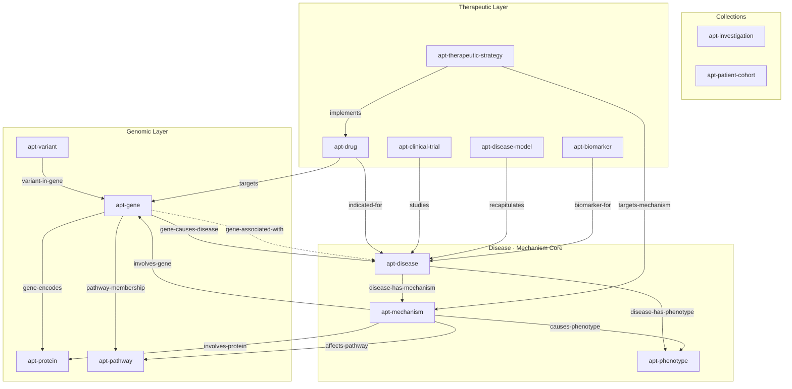

# Algorithm for Precision Therapeutics (APT)

A knowledge graph skill for systematic rare disease mechanism-of-harm investigation and
therapeutic landscape analysis. Starting from a known MONDO disease ID, it builds a
mechanism-centered knowledge graph connecting causal genes through biological pathways
to clinical phenotypes, then maps rational therapeutic strategies onto that mechanism map.

Implements **Matt Might's Algorithm for Precision Medicine (APM) Phase 2 — Therapeutic
Phase** as a structured, reproducible knowledge curation workflow.

---

## When to Use This

Use this skill when:
- A diagnosis is **already known** (you have a MONDO ID or disease name)
- The goal is to understand **how the disease causes harm** at the molecular level
- You want to build a **therapeutic landscape** — what treatments exist or are rational
- You need a structured **rare disease knowledge graph** for a specific condition

**Not for:** differential diagnosis, variant pathogenicity classification, or finding a
diagnosis from symptoms.

---

## The Central Innovation: `apt-mechanism` as a First-Class Entity

Most disease databases treat "mechanism of harm" as a label on a gene–disease relation.
APT promotes it to a **first-class entity** — `apt-mechanism` — with rich attributes and
its own relation chains:

```
Gene → [mechanism-involves-gene] → Mechanism → [mechanism-causes-phenotype] → Phenotype
                                        ↑
                              [strategy-targets-mechanism]
                                        |
                             TherapeuticStrategy → [strategy-implements] → Drug
```

This makes the knowledge graph traversable from genomic cause through biological mechanism
to clinical presentation and back up to therapeutic intervention — all as explicit,
queryable graph paths.

---

## Schema Diagram



**Solid arrows** = causal / mechanistic relations. **Dashed arrow** = statistical association
(non-causal). The `apt-mechanism` node is the hub connecting the genomic layer (left) to
the therapeutic layer (top) and phenotypic outcomes (right).

---

## Five-Phase Workflow

### Phase 1 — Foraging: Find and Initialize the Disease

Search for a MONDO ID and create the investigation root:

```bash
SCRIPT=".claude/skills/alg-precision-therapeutics/alg_precision_therapeutics.py"

uv run python $SCRIPT search-disease --query "NGLY1 deficiency"
# => {"diseases": [{"mondo_id": "MONDO:0800044", "name": "NGLY1 deficiency", ...}]}

uv run python $SCRIPT init-investigation MONDO:0800044
# Creates: apt-disease + apt-investigation + apt-mondo-record artifact
```

### Phase 2 — Ingestion: Pull External Data

Automated retrieval from Monarch Initiative, ClinicalTrials.gov, and ChEMBL:

```bash
# Full pipeline in one command:
uv run python $SCRIPT ingest-disease --mondo-id MONDO:0800044

# Or step by step:
uv run python $SCRIPT ingest-phenotypes --disease apt-disease-xxxx  # Monarch HPO
uv run python $SCRIPT ingest-genes      --disease apt-disease-xxxx  # Monarch gene associations
uv run python $SCRIPT ingest-hierarchy  --disease apt-disease-xxxx  # MONDO subclass tree
uv run python $SCRIPT ingest-clintrials --disease apt-disease-xxxx  # ClinicalTrials.gov
uv run python $SCRIPT ingest-drugs      --disease apt-disease-xxxx  # ChEMBL drug targets
```

All retrieved data is stored as **artifacts** (raw API responses) in TypeDB, ready for
Claude to read during sensemaking.

### Phase 3 — Sensemaking: Claude Reads Artifacts

Claude reads the raw artifacts and synthesizes:
- What mechanism(s) of harm are implied by the gene associations?
- Which genes are causally implicated vs. statistically associated?
- What is the severity and breadth of the phenotypic burden?
- What therapeutic modalities are plausible given the mechanism type?

```bash
uv run python $SCRIPT list-artifacts --disease apt-disease-xxxx
uv run python $SCRIPT show-artifact --id apt-artifact-xxxx
```

### Phase 4 — Build the Mechanism Knowledge Graph

Claude constructs the mechanism graph based on sensemaking, using the APM mechanism
taxonomy:

| Type | Description |
|------|-------------|
| `GoF` | Gain of function — protein does too much |
| `LoF-partial` | Partial loss of function — reduced activity |
| `LoF-total` | Complete loss of function — absent activity |
| `dominant-negative` | Mutant protein inhibits wild-type |
| `haploinsufficiency` | One copy insufficient for normal function |
| `toxic-aggregation` | Toxic protein accumulation |
| `pathway-dysregulation` | Indirect pathway dysregulation |

```bash
# Add mechanism of harm
uv run python $SCRIPT add-mechanism \
  --disease apt-disease-xxxx \
  --type LoF-total \
  --level molecular \
  --description "NGLY1 loss of function prevents deglycosylation of misfolded proteins"

# Link to causal gene, affected pathway, downstream phenotypes
uv run python $SCRIPT link-mechanism-gene      --mechanism apt-mechanism-xxxx --gene apt-gene-xxxx
uv run python $SCRIPT link-mechanism-phenotype --mechanism apt-mechanism-xxxx --phenotype apt-phenotype-xxxx

# Add a therapeutic strategy targeting this mechanism
uv run python $SCRIPT add-strategy \
  --mechanism apt-mechanism-xxxx \
  --modality enzyme-replacement \
  --rationale "Restore NGLY1 enzymatic activity via ERT or gene therapy"

# Link a drug to the strategy
uv run python $SCRIPT link-drug-mechanism --drug apt-drug-xxxx --mechanism apt-mechanism-xxxx
```

### Phase 5 — Analysis Views

Structured views of the completed knowledge graph:

```bash
uv run python $SCRIPT show-disease          --mondo-id MONDO:0800044  # Full overview
uv run python $SCRIPT show-mechanisms       --mondo-id MONDO:0800044  # Mechanism chains
uv run python $SCRIPT show-therapeutic-map  --mondo-id MONDO:0800044  # Strategies per mechanism
uv run python $SCRIPT show-phenome          --mondo-id MONDO:0800044  # Phenotypic spectrum
uv run python $SCRIPT show-genes            --mondo-id MONDO:0800044  # Gene evidence table
uv run python $SCRIPT show-trials           --mondo-id MONDO:0800044  # Clinical trials
uv run python $SCRIPT build-corpus          --mondo-id MONDO:0800044  # Literature search seeds
```

---

## Entity Types

### Domain Things (the scientific objects)

| Entity | Key Identifiers | Description |
|--------|----------------|-------------|
| `apt-disease` | MONDO, OMIM, ORPHA, DOID | The disease under investigation |
| `apt-gene` | HGNC, Ensembl, Entrez | Causal or associated gene |
| `apt-protein` | UniProt, domain annotations | Protein product of a gene |
| `apt-mechanism` | type, level, addressability | **First-class mechanism of harm entity** |
| `apt-pathway` | Reactome, GO | Biological pathway implicated in the mechanism |
| `apt-phenotype` | HPO | Clinical feature observable in patients |
| `apt-variant` | HGVS c/p/g, ACMG class | Genomic variant (for cohort tracking) |
| `apt-drug` | DrugBank, ChEMBL, modality | Therapeutic compound |
| `apt-therapeutic-strategy` | approach, modality | Rational therapeutic approach |
| `apt-clinical-trial` | NCT ID, phase, status | Clinical trial studying the disease |
| `apt-disease-model` | species, model type | Experimental model system |
| `apt-biomarker` | type | Measurable disease-state indicator |

### Collections (organisational roots)

| Entity | Description |
|--------|-------------|
| `apt-investigation` | MONDO-rooted investigation — the top-level container |
| `apt-patient-cohort` | Optional set of patients sharing phenotype/genotype |

---

## Artifacts, Fragments, and Notes

The APT schema follows the Alhazen content hierarchy for captured knowledge:

**Artifacts** (raw API captures):

| Artifact | Source |
|----------|--------|
| `apt-mondo-record` | MONDO ontology lookup |
| `apt-monarch-assoc-record` | Monarch Initiative phenotype/gene associations |
| `apt-omim-record` | OMIM disease entry |
| `apt-clinvar-record` | ClinVar variant classifications |
| `apt-gnomad-record` | gnomAD population frequency data |
| `apt-clintrials-record` | ClinicalTrials.gov study records |
| `apt-chembl-record` | ChEMBL drug–target associations |
| `apt-sequencing-report` | Patient sequencing report |

**Fragments** (extracted claims from artifacts):

| Fragment | Content |
|----------|---------|
| `apt-mechanism-claim` | Extracted mechanism assertion with confidence |
| `apt-phenotype-entry` | HPO phenotype with frequency and evidence code |
| `apt-drug-interaction` | Drug mechanism-of-action extracted from ChEMBL |
| `apt-variant-call` | HGVS variant call with ACMG classification |

**Notes** (Claude's analysis):

| Note | Content |
|------|---------|
| `apt-disease-overview-note` | High-level disease summary |
| `apt-mechanism-analysis-note` | Detailed mechanism-of-harm reasoning |
| `apt-therapeutic-strategy-note` | Therapeutic approach rationale |
| `apt-phenotypic-spectrum-note` | Phenotypic burden analysis |
| `apt-literature-synthesis-note` | Synthesis across literature |
| `apt-research-gaps-note` | Unresolved questions and evidence gaps |
| `apt-impact-assessment-note` | Patient impact and clinical significance |

---

## External Data Sources

| Source | Data | API |
|--------|------|-----|
| [Monarch Initiative v3](https://monarchinitiative.org) | Disease→phenotype, disease→gene associations | `https://api-v3.monarchinitiative.org/v3/api` |
| [ClinicalTrials.gov](https://clinicaltrials.gov) | Active and completed trials | `https://clinicaltrials.gov/api/v2/studies` |
| [ChEMBL](https://www.ebi.ac.uk/chembl/) | Drug–target associations by gene symbol | `https://www.ebi.ac.uk/chembl/api/data` |
| [MONDO](https://mondo.monarchinitiative.org) | Disease ontology hierarchy and xrefs | Via Monarch API |

---

## Prerequisites

- TypeDB 3.x running: `make db-start`
- APT schema loaded: `make db-init`
- Python deps: `uv sync --all-extras`

---

## Relation to APM / Rare-Disease Skills

This skill **unifies and replaces** two earlier skills:

- **`apm`** — Patient-centric APM Phase 1+2; used TypeDB 2.x syntax (now broken)
- **`rare-disease`** — Disease-centric 360° knowledge graph; TypeDB 3.x compatible, but
  treated mechanism-of-harm as a relation attribute rather than a first-class entity

The key architectural advance in APT is promoting `apt-mechanism` to a full domain entity,
which enables traversable paths from genomic cause → mechanism → phenotype → therapy
that can be queried, annotated, and reasoned over directly in the knowledge graph.
